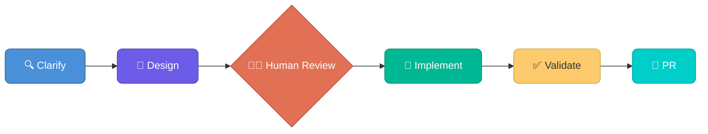
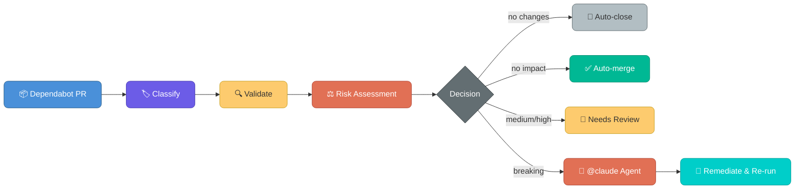

# Getting Started

## Overview

**Terraform Agentic Workflows** is a development template that uses AI agents to build production-ready Terraform code through **Spec-Driven Development (SDD)** — a structured workflow:



It supports four core use cases:

- **Module Authoring** — Create reusable Terraform modules with raw resources and secure defaults
- **Provider Development** — Build Terraform Provider resources using HashiCorp's Plugin Framework
- **Consumer Provisioning** — Compose infrastructure from private registry modules and deploy to HCP Terraform
- **Policy Authoring** — Write tfpolicy compliance policies with TDD (`/tf-policy-plan`, `/tf-policy-implement`)

Each workflow is driven by slash commands (e.g., `/tf-module-plan`) that orchestrate multiple AI agents through the phases. The template supports two AI coding assistants:

| Assistant | Devcontainer | Skills & agents | MCP config |
|-----------|-------------|-----------------|------------|
| **Claude Code** | `.devcontainer/claude-code/` | `.claude/skills/` and `.claude/agents/` | `.mcp.json` |
| **GitHub Copilot** | `.devcontainer/copilot-cli/` | `.claude/skills/`, `.claude/agents/`, and `.agents/agents/` (discovered via the `.github/agents` symlink) | `devcontainer.json` (`customizations.vscode.mcp`) |

The same slash commands work in both tools. Copilot CLI supports skill and agent lookup from `.claude/` directories in addition to the Copilot-dialect agents in `.agents/agents/` — Copilot only discovers repo agents under `.github/agents/`, which in this repo is a symlink to `.agents/agents/`. The underlying tool names differ between the two (see [Tool Name Mapping](tool-name-mapping.md)), but the user experience is the same.

> **Alternative: install as a plugin.** Instead of using this repo as a template, the workflows can be installed as a plugin into any repository — for Claude Code, GitHub Copilot CLI, or (experimentally) Cursor. See [Install as a plugin](../README.md#install-as-a-plugin) in the README.

---

## Prerequisites

### Required Software

Install these on your **host machine** — everything else is provided by the devcontainer:

| Tool | Purpose |
|------|---------|
| [Docker Desktop](https://www.docker.com/products/docker-desktop/) **or** [Podman](https://podman.io/) | Run the devcontainer |
| [VS Code](https://code.visualstudio.com/) | IDE with Dev Containers extension |

Install the **Dev Containers** extension in VS Code (`ms-vscode-remote.remote-containers`).

> **Using Podman instead of Docker?** Open the Podman-tuned variant for your
> assistant — `.devcontainer/claude-code-podman/`, `.devcontainer/copilot-cli-podman/`,
> or `.devcontainer/bob-podman/` (Bob is Podman-only) — and follow
> [Podman hosts](#podman-hosts) below. The default Docker variants
> (`.devcontainer/claude-code/`, `.devcontainer/copilot-cli/`) are unchanged and
> remain Docker-only.

### Podman hosts

The Podman variants all run rootless podman-in-podman with the `podman-docker`
shim, so the Terraform MCP server's `docker run …` command works unchanged
inside the container. They need this one-time host setup:

1. **Podman 4.x+ rootless, with the socket service running:**

   ```bash
   systemctl --user enable --now podman.socket
   ```

2. **Point the Dev Containers tooling at Podman** — in VS Code `settings.json`:

   ```jsonc
   "dev.containers.dockerPath": "podman"
   ```

   or from the CLI:

   ```bash
   devcontainer up --docker-path podman --workspace-folder . \
     --config .devcontainer/claude-code-podman/devcontainer.json
   ```

3. **Bob IDE only** — Bob IDE 2.0 has no built-in Dev Containers support.
   Install the `mythreyak.open-remote-devcontainer` extension and set
   `"remote.devcontainer.containerBinary": "podman"` (renamed to
   `remote.devcontainer.engine` in newer extension releases).

Per-variant detail — user mapping, SELinux, nested storage and networking — is
in each variant's `readme.md`.

> All other tools (Terraform, TFLint, terraform-docs, Trivy, Go, GitHub CLI, Vault Radar, Claude Code CLI) are pre-installed inside the devcontainer.

### Required Accounts

- **GitHub** account with a [fine-grained personal access token](#1-github-fine-grained-personal-access-token)
- **HCP Terraform** account with a [Team API token](#2-hcp-terraform-setup)
- **AWS** account (you do not need AWS CLI or local credentials — all AWS access flows through HCP Terraform workspace variables)
- **AI assistant** — one of the following:
  - **Claude Code** — authenticate via `claude login` inside the devcontainer, or set `ANTHROPIC_API_KEY` in your shell profile
  - **GitHub Copilot** — requires a Copilot license; run `copilot login` inside the devcontainer or sign in via VS Code's built-in GitHub authentication when prompted

---

## Environment Setup

### 1. GitHub Fine-Grained Personal Access Token

Fine-grained tokens provide scoped access with granular permissions. Classic tokens (`ghp_*`) are not recommended.

**Create the token:**

1. Go to **GitHub Settings** → **Developer Settings** → **Personal access tokens** → **Fine-grained tokens**
2. Click **Generate new token**
3. Set a descriptive name and expiration
4. Under **Repository access**, select the repositories this template will manage
5. Set the following **Repository permissions**:

| Permission | Access | Why |
|------------|--------|-----|
| Contents | Read & Write | Clone, push, create branches |
| Issues | Read & Write | Create and update tracking issues |
| Pull requests | Read & Write | Create PRs, post comments |
| Workflows | Read & Write | Trigger and manage GitHub Actions |
| Metadata | Read | Required baseline |

6. Click **Generate token** and copy it immediately

**Export the token** (and add to your shell profile so it persists across sessions):

```bash
export GITHUB_TOKEN="github_pat_your_token_here"
# Add the line above to ~/.zshrc or ~/.bashrc for persistence
```

### 2. HCP Terraform Setup

The template uses HCP Terraform for remote execution, state management, and workspace automation. You need an isolated project with a dedicated team.

#### Create a Dedicated Project

1. Navigate to **Projects** in [HCP Terraform](https://app.terraform.io/)
2. Create a new project (e.g., `sandbox`)
3. This isolates test workspaces from production infrastructure

#### Create a Dedicated Team

1. Go to **Settings** → **Teams**
2. Create a new team and assign it to the dedicated project
3. Configure **Project Team Access** with these permissions:

**Project Access:**

| Permission | Required | Why |
|------------|----------|-----|
| Read | Yes | List and view project workspaces |
| Create Workspaces | Yes | Consumer workflows create sandbox workspaces |
| Delete Workspaces | Yes | Clean up sandbox workspaces after testing |

**Workspace Permissions:**

| Permission | Required | Why |
|------------|----------|-----|
| Read Variables | Yes | Inspect workspace configuration |
| Read State | Yes | Access state for planning and validation |
| Write State | Yes | Apply changes to workspace state |
| Apply Runs | Yes | Queue and apply runs to deploy sandbox workspaces |
| Download Sentinel Mocks | Yes | Policy testing support |
| Lock/Unlock Workspaces | Yes | Prevent concurrent modifications during runs |

#### Generate Team API Token

1. Go to **Organization Settings** → **API Tokens** → **Team Tokens** → **[Your Team]**
2. Click **Create a team token**
3. Save this token — it cannot be retrieved later

> **Important:** This must be a **Team API Token**, not a user or organization token. The devcontainer maps `TEAM_TFE_TOKEN` to `TFE_TOKEN` automatically.

**Export the token** (and add to your shell profile so it persists across sessions):

```bash
export TEAM_TFE_TOKEN="your_terraform_team_token_here"
# Add the line above to ~/.zshrc or ~/.bashrc for persistence
```

> **Day 2 Operations:** If you plan to use the [consumer module uplift pipeline](#day-2-operations--consumer-module-uplift), also configure a `TFE_TOKEN_DEPENDABOT` repository secret (Settings -> Secrets and variables -> Dependabot) with read-only access to the private module registry.

### 3. AWS Credentials

AWS credentials are managed through HCP Terraform, not set locally. The devcontainer and CI runners never hold AWS credentials directly.

#### Option 1: Dynamic Provider Credentials (Recommended)

Use OIDC federation between HCP Terraform and AWS for short-lived, automatically rotated credentials.

See: [Dynamic Provider Credentials](https://developer.hashicorp.com/terraform/cloud-docs/workspaces/dynamic-provider-credentials/aws-configuration)

#### Option 2: Variable Set with Environment Variables

1. In HCP Terraform, go to **Settings** → **Variable Sets**
2. Create a new Variable Set with:

| Variable | Type | Sensitive |
|----------|------|-----------|
| `AWS_ACCESS_KEY_ID` | Environment | Yes |
| `AWS_SECRET_ACCESS_KEY` | Environment | Yes |
| `AWS_REGION` | Environment | No |

3. **Attach the Variable Set to your project** — all workspaces inherit credentials automatically

### 4. Shell Configuration

Verify that both tokens are in your shell profile (`~/.zshrc` or `~/.bashrc`) so the devcontainer can access them:

```bash
# ~/.zshrc or ~/.bashrc
export GITHUB_TOKEN="github_pat_your_token_here"
export TEAM_TFE_TOKEN="your_terraform_team_token_here"

# Optional: Vault Radar secret scanning in the git pre-commit hook
# export VAULT_RADAR_LICENSE="your_license_here"
```

Reload your shell after editing:

```bash
source ~/.zshrc    # or: source ~/.bashrc
```

---

## First Run

### 1. Create Repository from Template

1. Navigate to this repository on GitHub
2. Click **Use this template** → **Create a new repository**
3. Name your repository, configure visibility, and click **Create repository**

### 2. Clone and Open in Devcontainer

```bash
git clone https://github.com/YOUR_ORG/your-new-repo.git
code your-new-repo
```

When VS Code opens, it will detect the devcontainer configuration and prompt you to **Reopen in Container**. The repository includes these devcontainer variants:

| Variant | Path | Picker name | Use when |
|---------|------|-------------|----------|
| `claude-code` | `.devcontainer/claude-code/` | `… - Claude Code` | You have a Claude Code subscription (recommended for this template) |
| `copilot-cli` | `.devcontainer/copilot-cli/` | `… - Copilot` | You use GitHub Copilot as your AI coding assistant |
| `claude-code-podman` | `.devcontainer/claude-code-podman/` | `… - Claude Code (Podman)` | Claude Code with rootless Podman instead of Docker Desktop |
| `copilot-cli-podman` | `.devcontainer/copilot-cli-podman/` | `… - Copilot (Podman)` | Copilot CLI with rootless Podman instead of Docker Desktop |
| `bob-podman` | `.devcontainer/bob-podman/` | `… - Bob (Podman)` | IBM Bob Shell on rootless Podman (no Docker variant) |
| `vscode-agent` | `.devcontainer/vscode-agent/` | `… - Copilot` | The VS Code agent mode without a dedicated assistant CLI |

> **Note:** `vscode-agent` and `copilot-cli` currently share the same picker
> name (`… - Copilot`); pick by config path if you need to distinguish them.

The devcontainer includes all required tools pre-installed:

| Tool | Version | Purpose |
|------|---------|---------|
| Terraform | 1.15.x | Infrastructure as Code |
| TFLint | 0.60.x | Terraform linting |
| terraform-docs | 0.21.x | Documentation generation |
| Trivy | Latest | Security scanning |
| Go | 1.24.x | Provider development |
| GitHub CLI | Latest | Repository operations |
| Vault Radar | 0.43.x | Secret detection |
| Claude Code | Latest | AI agent orchestration (claude-code variant) |
| Infracost | 0.10.x | Cost estimation |
| Checkov | 3.2.x | Policy-as-code scanning |
| golangci-lint | 2.10.x | Go linting (provider development) |

> Versions are pinned in `.devcontainer/base-image/Dockerfile`; the variant
> images build `FROM srlynch1/terraform-ai-tools:latest`, so what you actually
> get tracks the last base-image publish.

### 3. Validate Environment

Run the environment validation script to confirm everything is configured:

```bash
bash .foundations/scripts/bash/validate-env.sh
```

The script classifies checks as:

- **GATE** — Must pass to proceed: `TFE_TOKEN`; `TFE_TOKEN_TYPE` (introspected via `/api/v2/account/details` — user and organization tokens are rejected, only a Team API Token or service account passes); `GITHUB_TOKEN`; `GH_CLI` (installed and authenticated); `TERRAFORM` (>= 1.14)
- **WARN** — Nice-to-have; degrades capability but doesn't block (TFLint, pre-commit, Trivy, terraform-docs)

Exit codes: `0` all checks passed, `1` a GATE failed (stop), `2` gates passed but a WARN failed.

If all gates pass, the script initializes TFLint. Git hooks are enabled separately by the devcontainer via `git config core.hooksPath .githooks` — see [Git & agent hooks](#git--agent-hooks).

### 4. Branch Protection (Recommended)

Configure [branch protection rules](https://docs.github.com/en/repositories/configuring-branches-and-merges-in-your-repository/managing-a-branch-protection-rule/about-protected-branches) or [repository rulesets](https://docs.github.com/en/repositories/configuring-branches-and-merges-in-your-repository/managing-rulesets/about-rulesets) on `main` to enforce quality gates before merge.

**Recommended settings:**

| Setting | Value | Why |
|---------|-------|-----|
| Require pull request before merging | Yes | All changes go through review |
| Required approvals | 1+ | Peer review for infrastructure code |
| Dismiss stale approvals on new commits | Yes | Re-review after changes |
| Require conversation resolution | Yes | All review comments addressed |
| Require status checks to pass | Yes | CI must be green before merge |
| Block force pushes | Yes | Protect audit trail |
| Block branch deletion | Yes | Prevent accidental deletion |

**Required status checks** (from `.github/workflows/module_validate.yml`, which runs fmt, validate, tflint, trivy, and terraform test — the status-check contexts are the job names):

- `Validate Module`
- `Validate Examples (basic)`
- `Validate Examples (complete)`

> **Note:** `module_validate.yml` already triggers on `pull_request` (path-filtered to `**.tf`, `**.tfvars`, `**.tftest.hcl`, and the workflow file itself) as well as `workflow_dispatch`, so the checks appear on PRs automatically — no trigger changes are needed. Because the trigger is path-filtered, PRs that touch no Terraform files won't produce these checks; keep that in mind when marking them required.
>
> **Semver labels:** `module_validate.yml` requires exactly one `semver:patch` / `semver:minor` / `semver:major` label on every PR it validates, and `module_release.yml` uses that label to compute the published version. Repos created from a template do **not** inherit labels, so create them once per repo (the module and consumer implement workflows also do this automatically before opening a PR):
>
> ```bash
> gh label create "semver:patch" --color C2E0C6 --force
> gh label create "semver:minor" --color BFD4F2 --force
> gh label create "semver:major" --color F9D0C4 --force
> ```
>
> Branch protection is the only thing preventing direct commits to `main` — the local git hook does not block them.
>
> **References:**
> - [Managing branch protection rules](https://docs.github.com/en/repositories/configuring-branches-and-merges-in-your-repository/managing-a-branch-protection-rule/managing-a-branch-protection-rule)
> - [Managing rulesets](https://docs.github.com/en/repositories/configuring-branches-and-merges-in-your-repository/managing-rulesets/managing-rulesets-for-a-repository)
> - [Required status checks](https://docs.github.com/en/repositories/configuring-branches-and-merges-in-your-repository/managing-a-branch-protection-rule/troubleshooting-required-status-checks)


### 5. Try Your First Workflow

Once validation passes, open your AI assistant and run your first workflow:

**Claude Code:**

```bash
# Open the Claude Code terminal, then type:
/tf-module-plan
```

**GitHub Copilot:**

Open Copilot Chat in agent mode (`@workspace`) and type:

```
/tf-module-plan
```

Both tools will walk you through clarification questions, research AWS docs and provider resources, then produce a design document in `specs/`. When you're ready to implement:

```
/tf-module-implement
```

This writes tests first (TDD), builds the module to pass them, and runs the full quality pipeline.

---

## Core Workflows

All four workflows follow the same SDD structure. Start any workflow by typing the slash command in Claude Code or Copilot Chat.

### Module Authoring

Create reusable Terraform modules with direct provider resources (not module wrappers), secure defaults, and comprehensive tests.

| Aspect | Detail |
|--------|--------|
| **Plan & Design** | `/tf-module-plan` |
| **Implement & Validate** | `/tf-module-implement` |
| **Constitution** | `.foundations/memory/module-constitution.md` |
| **Design template** | `.foundations/templates/module-design-template.md` |

**What it produces:**

- Standard module structure (`versions.tf`, `variables.tf`, `main.tf`, `outputs.tf`)
- `.tftest.hcl` test files with mock and integration scenarios
- Auto-generated `README.md` via terraform-docs
- Security controls (encryption, access, logging, tagging)

**Phases:**

1. **Clarify** — Gather requirements, ask clarification questions, research AWS docs and provider resources
2. **Design** — Produce `specs/{feature}/design.md` with architecture, interfaces, security controls, test scenarios
3. **Human Review** — Approve the design before any code is written
4. **Implement** — Write tests first (TDD), then build resources to pass them
5. **Validate** — Run `terraform fmt`, `validate`, `test`, `tflint`, `trivy`, `terraform-docs`
6. **PR** — Create a pull request with the implementation for final review

### Provider Development

Build Terraform Provider resources using HashiCorp's Plugin Framework.

| Aspect | Detail |
|--------|--------|
| **Plan & Design** | `/tf-provider-plan` |
| **Implement & Validate** | `/tf-provider-implement` |
| **Constitution** | `.foundations/memory/provider-constitution.md` |
| **Design template** | `.foundations/templates/provider-design-template.md` |

**What it produces:**

- Go resource implementation with CRUD operations
- Schema design with typed attributes and validators
- Acceptance test suite with sweep functions
- State migration handling

**Phases:**

1. **Clarify** — Research cloud service APIs, Plugin Framework patterns, existing providers
2. **Design** — Produce `specs/{feature}/provider-design-{resource}.md` with schema, CRUD logic, error handling
3. **Human Review** — Approve the design before any code is written
4. **Implement** — Write test stubs first, then implement CRUD methods
5. **Validate** — Run `go test`, `golangci-lint`, acceptance tests
6. **PR** — Create a pull request with the implementation for final review

### Consumer Provisioning

Compose infrastructure from private registry modules and deploy to HCP Terraform.

| Aspect | Detail |
|--------|--------|
| **Plan & Design** | `/tf-consumer-plan` |
| **Implement & Validate** | `/tf-consumer-implement` |
| **Constitution** | `.foundations/memory/consumer-constitution.md` |
| **Design template** | `.foundations/templates/consumer-design-template.md` |

**What it produces:**

- Consumer configuration composing private registry modules
- Workspace configuration with `cloud {}` backend
- Variable definitions and module wiring
- Sandbox deployment to HCP Terraform

**Phases:**

1. **Clarify** — Research available private registry modules, wiring patterns, workspace config
2. **Design** — Produce `specs/{feature}/consumer-design.md` with module selection, wiring, security
3. **Human Review** — Approve the design before any code is written
4. **Implement** — Compose modules, configure workspace, deploy to sandbox
5. **Validate** — Run `terraform fmt` and `validate`, deploy to the sandbox workspace, score the run with `tf-consumer-validator`
6. **PR** — Create a pull request with the implementation for final review

> **Note:** Consumer code uses **only** private registry modules. Raw resources are prohibited except glue resources (`random_id`, `null_resource`, `terraform_data`). Module versions must use pessimistic constraints (`~> X.Y`).

### Policy Authoring

Write compliance policies with tfpolicy — `.policy.hcl` policy files with `.policytest.hcl` tests, built TDD-style.

| Aspect | Detail |
|--------|--------|
| **Plan & Design** | `/tf-policy-plan` |
| **Implement & Validate** | `/tf-policy-implement` |
| **Constitution** | `.foundations/memory/policy-constitution.md` |
| **Design template** | `.foundations/templates/policy-design-template.md` |

**What it produces:**

- `policies/*.policy.hcl` — policy definitions with enforcement levels (`mandatory`, `mandatory-overridable`, `advisory`)
- `tests/*.policytest.hcl` — one test file per policy file
- Compliance rule mapping (e.g. CIS AWS, NIST 800-53, PCI DSS) when a framework is supplied
- HCP Terraform policy set configuration: workspace targeting, evaluation stage, override permissions

**Phases:**

1. **Clarify** — Parse the compliance rule or policy set, consume any existing YAML rules from `policy-research/{framework-slug}*.yaml`, ask about enforcement levels, framework/control family, and target resource scope
2. **Design** — Produce `specs/{feature}/policy-design.md` with policy inventory, per-policy specifications, test scenarios, and HCP Terraform configuration
3. **Human Review** — Approve the design before any code is written
4. **Implement** — Write `.policytest.hcl` tests first (TDD), then build policies per checklist item
5. **Validate** — Run `tfpolicy validate --policies=policies/` and `tfpolicy test --policies=policies/ --tests=tests/`, plus quality scoring against the policy constitution
6. **PR** — Create a pull request with the implementation and the validation report linked

> **Note:** The policy engine is tfpolicy. Requests for a different engine are redirected to the constitution's exception process rather than silently switched.

---

## Day 2 Operations — Consumer Module Uplift

An automated pipeline for managing module version upgrades in consumer configurations. No manual version bumping required.

> **Note:** The example in this repo uses `@claude` for agent-assisted remediation of breaking changes. The equivalent is possible with any coding agent that has GitHub PR integration, including Copilot, Gemini, and others.

### How It Works



**Step-by-step:**

1. **Dependabot** detects a new module version in the private registry and creates a PR
2. **Classify** — Parses the git diff to detect which modules changed and the semver bump type (patch/minor/major)
3. **Validate** — Runs `terraform fmt` → `init` → `validate` → `tflint` → `plan`
4. **Risk Assessment** — A deterministic matrix (no AI) maps version type × plan impact to a risk level. It runs only when `terraform plan` exits 2 (changes present); a plan that exits 0 (no diff at all) skips risk assessment entirely and the PR is auto-closed:

| Plan Impact | Patch/Minor | Major |
|-------------|-------------|-------|
| **No adds, no changes** | Auto-merge (low) | Auto-merge (low) |
| **Adds only** | Needs review (low) | Needs review (medium) |
| **Changes to existing** | Needs review (medium) | Needs review (high) |
| **Destroy/Replace** | Breaking (high) | Breaking (critical) |
| **Plan fails** | Breaking (high) | Breaking (critical) |

5. **Decision** — Labels the PR (`risk:<level>`, `version:<type>`, plus a decision label) and acts:
   - **Auto-close** — Plan exit 0, no infrastructure diff at all; comment and close the PR
   - **Auto-merge** — Squash merge immediately (plan has a diff but no adds and no changes to existing resources)
   - **Needs-review** — Post the analysis comment, request review from `platform-team`, and post `@claude review and make a recommendation`
   - **Breaking-change** — Block merge, label `breaking-change`, and post `@claude review and make a recommendation`

### Agent Remediation

The pipeline posts `@claude review and make a recommendation` as a PR comment on any of four triggers: `terraform plan` fails, `terraform validate` fails, or the decision is `breaking-change` or `needs-review`. This triggers the `terraform-claude-review.yml` workflow, which invokes the **module-upgrade-remediation** agent. (Requires [Claude for GitHub](https://github.com/apps/claude) or equivalent app installed on the repository.)

The agent:

1. Fetches the **old and new module interfaces** from the private registry via [MCP](#mcp-servers)
2. Identifies missing inputs, removed outputs, type changes
3. Fixes the consumer `.tf` files (adds required inputs, updates output references)
4. Pushes the fix — the pipeline **re-runs automatically** on the adapted code
5. If the second pass is clean, the normal decision flow applies

### Post-Merge Apply

After a PR touching `**/*.tf` is merged to `main`:

1. Configuration is uploaded to the HCP Terraform workspace
2. A run is created and applied
3. On **success**: a comment is posted on the merged PR with the run link
4. On **failure**: an incident issue is created and a draft rollback PR is generated

### Configuration Files

| File | Purpose |
|------|---------|
| `.github/dependabot.yml` | Monthly scan of private Terraform registry |
| `.github/workflows/terraform-consumer-uplift.yml` | Multi-job uplift pipeline |
| `.github/workflows/terraform-apply.yml` | Post-merge apply workflow |
| `.github/workflows/terraform-claude-review.yml` | Handles `@claude` mention trigger on PRs |
| `.claude/agents/module-upgrade-remediation.md` | Claude agent for breaking change fixes |
| `.foundations/scripts/bash/classify-version-bump.sh` | Semver classification logic |

> **Note:** Dependabot requires a separate `TFE_TOKEN_DEPENDABOT` secret configured in your repository's Dependabot secrets (Settings → Secrets and variables → Dependabot). This token needs read-only access to the private module registry.

---

## What's Included

### Devcontainer

A fully configured development environment with all tools pre-installed. Open in VS Code and select **Reopen in Container**.

### MCP Servers

Configured in `.mcp.json`, available automatically in the devcontainer:

| Server | Description |
|--------|-------------|
| `terraform` | HCP Terraform — workspace management, run execution, registry lookups, variable management |
| `aws-documentation-mcp-server` | AWS documentation search, best practices, service recommendations |

The `terraform` server runs as a container (`docker run hashicorp/terraform-mcp-server`), so it needs a working `docker` binary *inside* the devcontainer — that's why the Podman variants ship the `podman-docker` shim.

> **Copilot differs:** `.devcontainer/copilot-cli/devcontainer.json` registers the server as `terraform-mcp` and omits `ENABLE_TF_OPERATIONS=true` and `--toolsets=all`, so Copilot sees a reduced Terraform MCP surface compared to `.mcp.json`. CI uses a separate `.mcp-ci.json`.

### Git & agent hooks

The pre-commit framework has been replaced by a single dispatcher,
`scripts/hooks/tf-guard.sh`, which serves Claude Code hooks, Copilot hooks, and
the native git hook at `.githooks/pre-commit`. The devcontainer wires it up with
`git config core.hooksPath .githooks` in `post-create.sh`. Background:
`docs/proposals/agent-hooks-migration.md`.

| Mode | Trigger | Checks |
|------|---------|--------|
| `fix` | After each agent file write | `terraform fmt`, `terraform-docs`, EOF newline, YAML syntax |
| `verify` | End of agent turn | `terraform validate`, `tflint`, `trivy`, private-key scan over changed dirs |
| `commit` | `git commit` | Vault Radar secret scan, large-file guard (500 KB, override with `TF_GUARD_MAXKB`), merge-conflict markers |

Individual checks live in `scripts/hooks/checks/`.

### TFLint

Configured in `.tflint.hcl` with three plugins and full rule coverage:

| Plugin | Version | Rules |
|--------|---------|-------|
| AWS | 0.46.0 | Auto-enabled resource validation + `aws_resource_missing_tags` |
| Azure | 0.31.1 | Auto-enabled resource validation |
| Terraform | 0.14.1 | All 20 rules explicitly configured (19 enabled, 1 disabled) |

> The base image pre-bakes slightly older rulesets (AWS 0.45.0, azurerm 0.30.0, plus a GCP ruleset that `.tflint.hcl` does not configure); `tflint --init` downloads the versions pinned above.

### Constitutions

Non-negotiable rules that govern all AI-generated code. Agents read the relevant constitution before generating any code.

| Constitution | Governs |
|-------------|---------|
| `.foundations/memory/module-constitution.md` | File organization, naming, security defaults, testing |
| `.foundations/memory/provider-constitution.md` | Plugin Framework patterns, CRUD, state management |
| `.foundations/memory/consumer-constitution.md` | Module composition, workspace config, backend setup |
| `.foundations/memory/policy-constitution.md` | Policy structure, enforcement levels, testing, HCP Terraform policy sets |

### Design Templates

Canonical starting points for Phase 2 design output. Each template defines the required sections for the design document.

| Template | Sections |
|----------|----------|
| `.foundations/templates/module-design-template.md` | Purpose, Resources, Interface, Security, Tests, Checklist |
| `.foundations/templates/provider-design-template.md` | Purpose, Schema, CRUD, Errors, Tests, Checklist |
| `.foundations/templates/consumer-design-template.md` | Purpose, Modules, Wiring, Security, Checklist |
| `.foundations/templates/policy-design-template.md` | Purpose, Policy Inventory, Specifications, Tests, HCP Config, Checklist |

---

## Project Structure

| Directory | Purpose |
|-----------|---------|
| `.claude/skills/` | Agent skills (slash commands) — used by both Claude Code and Copilot CLI |
| `.claude/agents/` | Subagent definitions (research, design, validate, remediate) — used by both Claude Code and Copilot CLI |
| `.agents/agents/` | GitHub Copilot agent definitions (same roles, Copilot tool names); `.github/agents` is a symlink into `.agents/` so Copilot discovery keeps working. Copilot hook configs stay in `.github/hooks/` — hooks are Copilot-only, so there is no second harness to share them with |
| `.foundations/memory/` | Constitutions — non-negotiable code generation rules |
| `.foundations/templates/` | Design document templates |
| `.foundations/scripts/bash/` | Automation scripts (`validate-env`, `checkpoint-commit`, `post-issue-progress`, `classify-version-bump`, `create-new-feature`, `scan-module-versions`) |
| `scripts/hooks/` | Shared hook dispatcher (`tf-guard.sh`) and individual checks |
| `.githooks/` | Native git hooks (enabled via `core.hooksPath`) |
| `.github/workflows/` | CI/CD pipelines (validate, apply, release, uplift) |
| `.claude-plugin/`, `.github/plugin/`, `.cursor-plugin/` | Plugin manifests for Claude Code, Copilot CLI, and Cursor |
| `evals/` | Workflow evals, including the e2e harness (`evals/e2e/`) |
| `specs/` | Feature design documents (created dynamically per workflow) |
| `docs/` | Documentation (this guide, reference site, tool mappings) |

---

## Additional Resources

- **[Documentation Site](index.html)** — Full reference site covering foundations, guardrails, SDD workflow, and configuration (open `docs/index.html` in your browser)
- **[AGENTS.md](../AGENTS.md)** — Agent inventory, skill list, and context management rules
- **[Tool Name Mapping](tool-name-mapping.md)** — Copilot CLI vs Claude Code tool name differences
